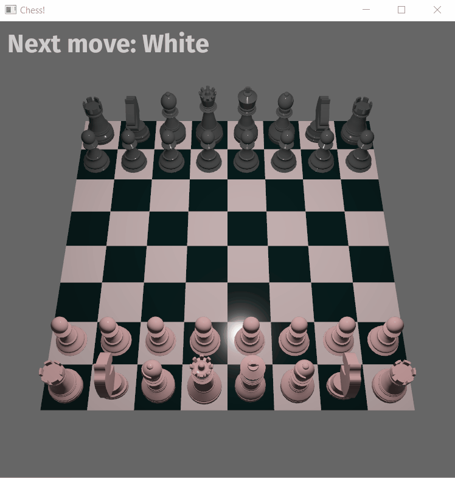

# Chess in Bevy

This is an implementation of Chess in the [Bevy](https://github.com/bevyengine/bevy) game engine.

I started by following [this tutorial](https://caballerocoll.com/blog/bevy-chess-tutorial/), and then branched off.

Here's a recording of the game:

